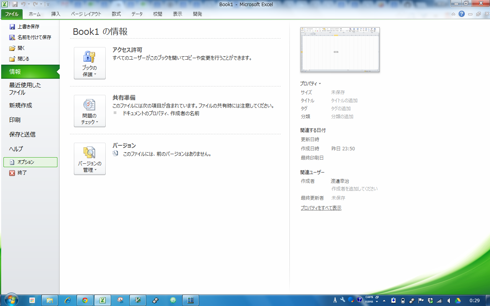
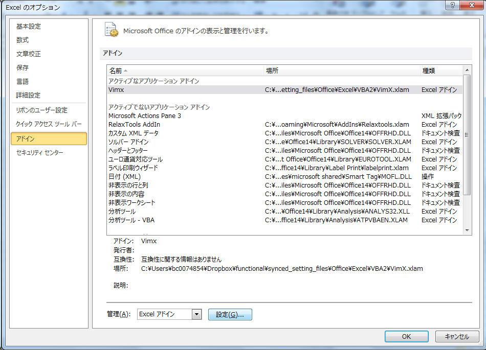
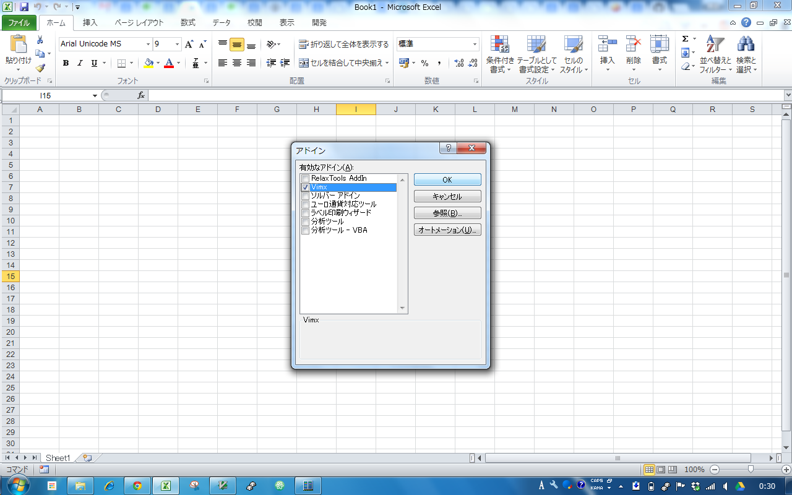

# What is ExcelLikeVim?

Vim for Excel. I hate using the mouse, especially after learning Vim. I'm very frustrated using Excel, I wanna use hjkl, dd, yy ,  ・・・like vim!. Is There some way to solve this? I found vimxls. But vimxls has some problem for me. For Example not customizable of mapping in setting file like .vimrc. ExcelLikeVim aims to eliminate this problem, and add many features inspired from popular vim plugin like budle, unite, ・・・.

# Where can I get ExcelLikeVim?
You can install it through git.
```bash
git clone https://github.com/kojinho10/ExcelLikeVim.git
```
Then register VimX.xlam As Excel addin.




# What can you do with ExcelLikeVim ?
These extensions do a wonderful job of adding Vim-like keybindings to Excel.

## Lists of features
* vim-like key mapping
  * mode feature (normal,visual,line_visual,command)
  * fully-customizable in ~/.vimxrc. (you can assign any functions to any keystroke you like!)
* unite interface like unite in vim. you can add your source, your action! Below default sources
  * mru
  * book
  * commnad
  * sheet
  * current column values (if you select candidates and press Enter, trigger filter current column with selected candidates)

# Default Keybindings
| Mode       | Keystroke | Function name                   |
| ---------- | :-------  | :------------------------------ |
| Normal     | `h`       | move_left
| Normal     | `j`         | move_down
| Normal     | `k`         | move_up
| Normal     | `l`         | move_right
| Normal     | `gg`        | gg
| Normal     | `G`         | G
| Normal     | `w`         | vim_w
| Normal     | `b`         | vim_b
| Normal     | `<c-u>`     | scroll_up
| Normal     | `<c-d>`     | scroll_down
| Normal     | `^`         | move_head
| Normal     | `$`         | move_tail
|
| Normal     | `i`         | insert_mode
| Normal     | `a`         | insert_mode
| Normal     | `v`         | n_v
| Normal     | `V`         | n_v_
| Normal     | `:`         | command_vim
| Normal     | `*`         | unite command
|
| Normal     | `/`         | find
| Normal     | `n`         | findNext
| Normal     | `N`         | findPrevious
|
| Normal     | `o`         | insertRowDown
| Normal     | `O`         | insertRowUp
| Normal     | `dd`        | n_dd
| Normal     | `dc`        | n_dc
| Normal     | `yy`        | n_yy
| Normal     | `yv`        | yank_value
| Normal     | `p`         | n_p
| Normal     | `u`         | n_u
| Normal     | `<ESC>`     | n_ESC
|
| Visual     | `<ESC>`     | v_ESC
|
| Visual     | `j`         | v_j
| Visual     | `k`         | v_k
| Visual     | `h`         | v_h
| Visual     | `l`         | v_l
| Visual     | `gg`        | v_gg
| Visual     | `G`         | v_G
| Visual     | `w`         | v_w
| Visual     | `b`         | v_b
| Visual     | `<c-u>`     | v_scroll_up
| Visual     | `<c-d>`     | v_scroll_down
| Visual     | `^`         | v_move_head
| Visual     | `$`         | v_move_tail
| Visual     | `a`         | v_a
| Visual     | `<HOME>`    | v_move_head
| Visual     | `<END>`     | v_move_tail
|
| Visual     | `:`         | command_vim
| Visual     | `y`         | v_y
| Visual     | `d`         | v_d
| Visual     | `D`         | v_D_
| Visual     | `x`         | v_x
|
| LineVisual | `j`         | v_j
| LineVisual | `k`         | v_k
| LineVisual | `gg`        | v_gg
| LineVisual | `G`         | v_G
| LineVisual | `<ESC>`     | v_ESC
| LineVisual | `y`         | v_y
| LineVisual | `d`         | lv_d
| LineVisual | `x`         | lv_d


# Customize by .vimxrc
you can customize mapping and behaviror of some function through setting option.
### Example configuration of .vimxrc
```vb

' AllKeyAssign_reset
' MouseNormal

'mapping
  'normal mode
    'move
      nmap <HOME> move_head
      nmap <END> move_tail

    'operator(edit)
      nmap t insertColumnRight
      nmap T insertColumnLeft

      nmap ;n InteriorColor(0)
      nmap ;r InteriorColor(3)
      nmap ;b InteriorColor(5)
      nmap ;y InteriorColor(6)
      nmap ;d InteriorColor(15)
      nmap 'y FontColor(0)
      nmap 'B FontColor(1)
      nmap 'w FontColor(2)
      nmap 'r FontColor(3)
      nmap 'b FontColor(5)
      nmap 'y FontColor(6)

      nmap m merge
      nmap M unmerge
      nmap > biggerFonts
      nmap < smallerFonts
      nmap z SetRuledLines
      nmap Z UnsetRuledLines

    'other
      nmap F9 toggleVimKeybinde
      nmap F10 -a updatemodules(ActiveWorkbook.Name)
      nmap <c-r> update
      nmap + ZoomInWindow
      nmap - ZoomOutWindow

      nmap gs SortCurrentColumn
      nmap gF focusFromScratch
      nmap gf focus
      nmap g- exclude
      nmap gc filterOff

      nmap H ex_left
      nmap J ex_below
      nmap K ex_up
      nmap L ex_right

      nmap ,m unite mru
      nmap ,s unite sheet
      nmap ,b unite book
      nmap ,p unite project
      nmap ,f unite filter

      nmap tl ActivateLeftSheet
      nmap th ActivateRightSheet
      nmap tL ActivateLastSheet
      nmap tH ActivateFirstSheet

  'visual mode
    'move
      vmap <HOME> v_move_head
      vmap <END> v_move_tail

    'operator
      vmap ;n visual_operation InteriorColor(0)
      vmap ;r visual_operation InteriorColor(3)
      vmap ;b visual_operation InteriorColor(5)
      vmap ;y visual_operation InteriorColor(6)
      vmap ;d visual_operation InteriorColor(15)
      vmap 'y visual_operation FontColor(0)
      vmap 'B visual_operation FontColor(1)
      vmap 'w visual_operation FontColor(2)
      vmap 'r visual_operation FontColor(3)
      vmap 'b visual_operation FontColor(5)
      vmap 'y visual_operation FontColor(6)

      vmap m visual_operation merge
      vmap M visual_operation unmerge
      vmap > visual_operation biggerFonts
      vmap < visual_operation smallerFonts
      vmap z visual_operation SetRuledLines
      vmap Z visual_operation UnsetRuledLines

  'line_visual mode
    lvmap ;n visual_operation InteriorColor(0)
    lvmap ;r visual_operation InteriorColor(3)
    lvmap ;b visual_operation InteriorColor(5)
    lvmap ;y visual_operation InteriorColor(6)
    lvmap ;d visual_operation InteriorColor(15)
    lvmap 'y visual_operation FontColor(0)
    lvmap 'B visual_operation FontColor(1)
    lvmap 'w visual_operation FontColor(2)
    lvmap 'r visual_operation FontColor(3)
    lvmap 'b visual_operation FontColor(5)
    lvmap 'y visual_operation FontColor(6)
    lvmap m visual_operation merge
    lvmap M visual_operation unmerge
    lvmap > visual_operation biggerFonts
    lvmap < visual_operation smallerFonts
    lvmap z visual_operation SetRuledLines
    lvmap Z visual_operation UnsetRuledLines

'ailias
  wrap unite_filter,unite filter
  wrap unite_mru,unite mru
  wrap unite_command_,unite command
  wrap unite_project,unite project

'book specific setting
  for task_management.xlsm:タスク一覧
    nmap o addtask_under
    nmap O addtask_upper
    nmap s start
    nmap e finish
    nmap . toggle_unvisible
    nmap gi ViewInbox
    nmap ga ViewAll
    nmap gn ViewNextDay
    nmap gp ViewPreviousDay
    'nmap N SendToNextDay
    nmap ,p unite project

```

# Contributing
Nice that you want to spend some time improving this Addin.
Solving issues is always appreciated. If you're going to add a feature,
it would be best to [submit an issue](https://github.com/kojinho10/ExcelLikeVim/issues).
You'll get feedback whether it will likely be merged.

# Tips
# log
fileformat changed
